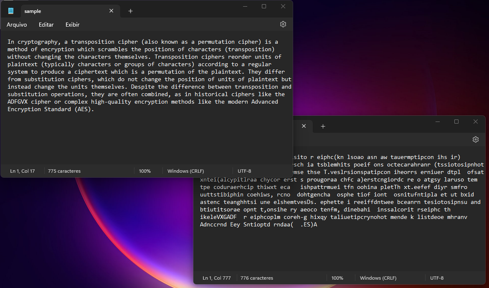

# Transposition cipher algorithm for text files

a transposition cipher is a method of encryption which scrambles the positions of characters (transposition) without changing the characters themselves

Here, we have implemented the encrypting algorithm using the MASM32 Assembly language.
The main target of this project is to understand the low-level operation of CPUs and the available instructions for Intel-like/Windows OS processors.

## How to use
- Choose an option between encrypt and decrypt (you must KNOW the key to decrypt!)
- Insert the path of an input text file
- Insert the path of an output text file
- Inform a numeric key of 8 digits (only numbers starting from 0 to 7)

## Some issues

Since this is a low-level language there are some things you should know in order to run

- CPU must have the Intel set of instructions (that means Intel and AMD processors)
- The Operational System must be Windows
- Your OS may think the program is malware, in this case, add it to your system's exceptions
- The Program will not check for invalid inputs; you can easily break it

Also, use the MAMS32 editor to rebuild
