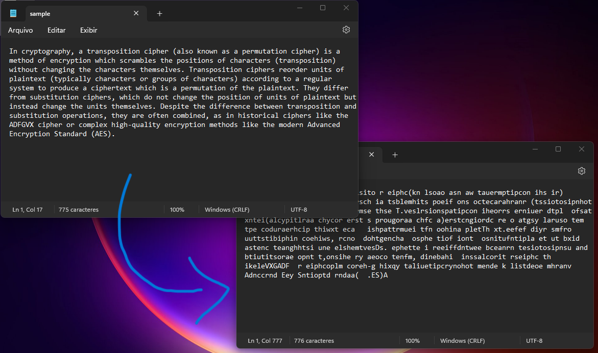

# Transposition cipher algorithm for text files

a transposition cipher is a method of encryption which scrambles the positions of characters (transposition) without changing the characters themselves

Here, we have implemented the encrypting algorithm using the MASM32 Assembly language.
The main target of this project is to understand the low-level operation of CPUs and the available instructions for Intel-like/Windows SO processors.

## Some issues

Since this is a low-level language there is some things you should know in order to run

- CPU must have the Intel set of instruction (that means Intel and AMD processors)
- Operational System must be Windows
- Your OS may think the program is a malware, in this case, add it to your system exceptions

Also use the MAMS32 editor to rebuild